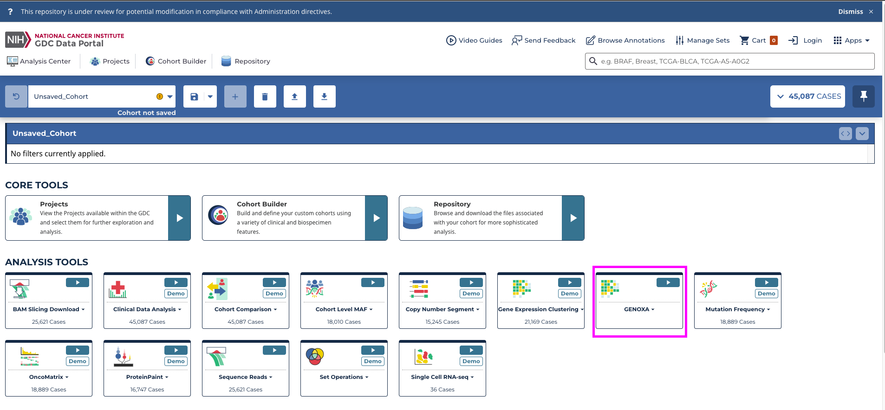
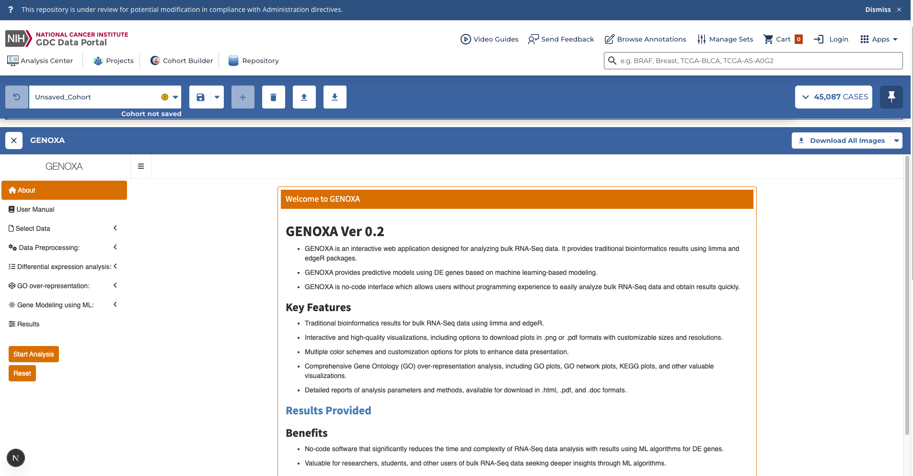
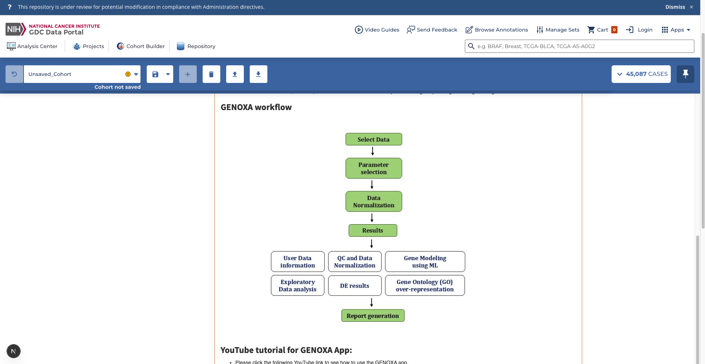
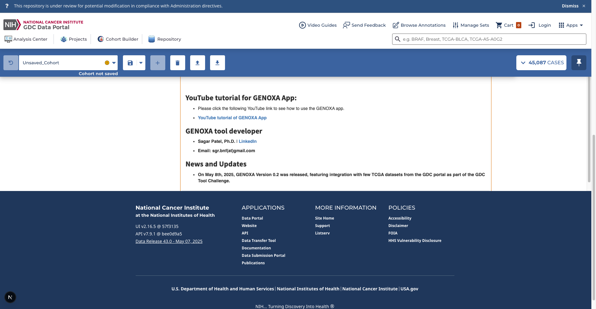
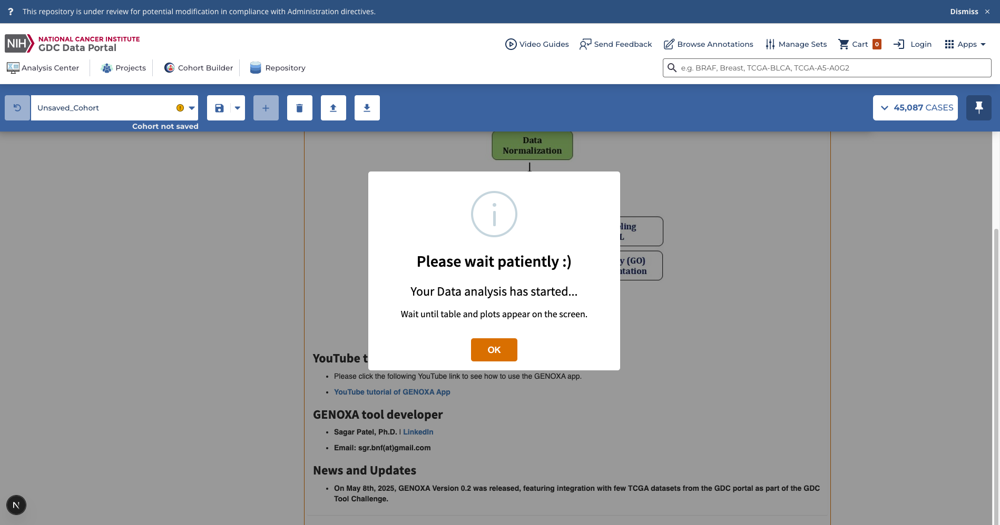
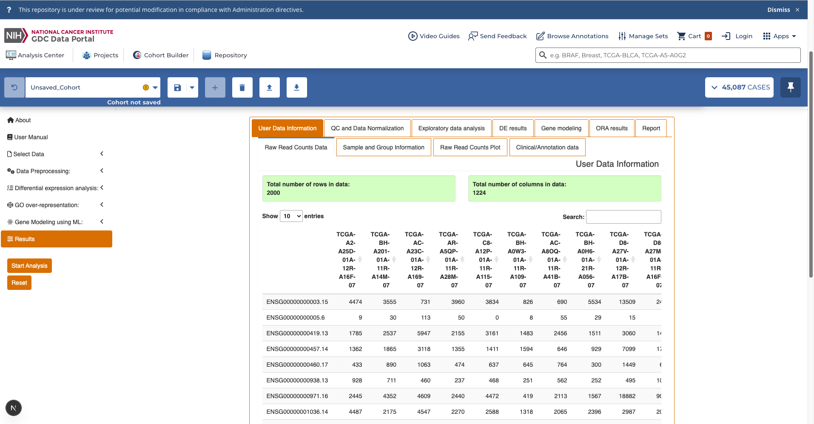

# GENOXA: A Tool for Analyzing Bulk RNA-Seq Data and Building Machine Learning Models with Differentially Expressed Genes

## 1. GDC Frontend Framework Installation

### Prerequisites

This is a multi-workspace repo that requires npm v10.2.4. The minimum node version is set to v20.11.0.

Node can be downloaded from the official Node.js site. You may also consider using a [Node version manager](https://docs.npmjs.com/cli/v7/configuring-npm/install#using-a-node-version-manager-to-install-nodejs-and-npm).

Your version of Node may not ship with npm v10.2.4. To install it, run:

```bash
npm install npm@10.2.4
```

If you are using a Node version manager, you can run the following to install the correct version of Node:

```bash
nvm install 20.11.0
```

to use the correct version of Node:

```bash
nvm use 20.11.0
```

### Install Dependencies

From the root of the project, install dependencies by running:

```bash
npm install
```

Installing from the root of the repository is required to avoid
multiple installations of React in the workspaces. When this happens,
React will fail to render.

### Adding Dependencies

Dependencies can also be installed from the root of the repository.
Error might occured for magin string module, run this command:-

```bash
npm install @napi-rs/magic-string-darwin-x64
```

Since this is a TypeScript project, installing the community type definitions may also be required:

```bash
npm install --save-dev @types/my-package --workspace=packages/core
```

## 2. Create docker image of GENOXA App

 Initially install docker 

Build docker image by going into the specific directory --> gc-docker-backend --> NCI_GENOXA_Lite
```bash
docker build -t genoxa .
```

Run the backend server by going into root --> gdc-docker-backend, then build the docker image and then run the docker image
```bash
node server.js
```
## 3. Development

Run the prototype in dev mode with auto-rebuilding into new terminal:

```bash
npm run dev
```

By default, this will start a dev server listening to http://localhost:3000

## 🖼️ Screenshot









## 🎬 Local Demo Video

[Click here to watch the demo](./assets/demo.mp4)

