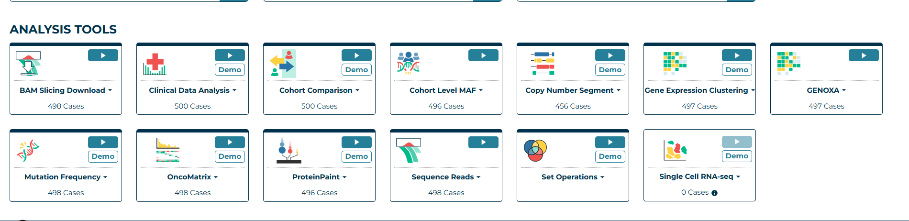
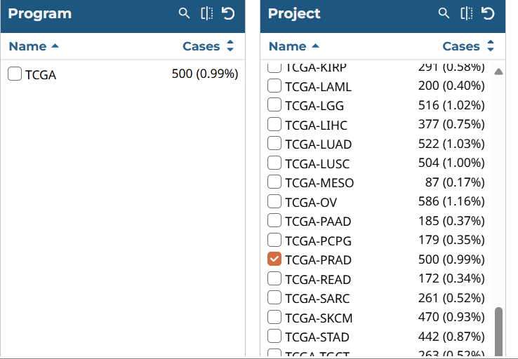
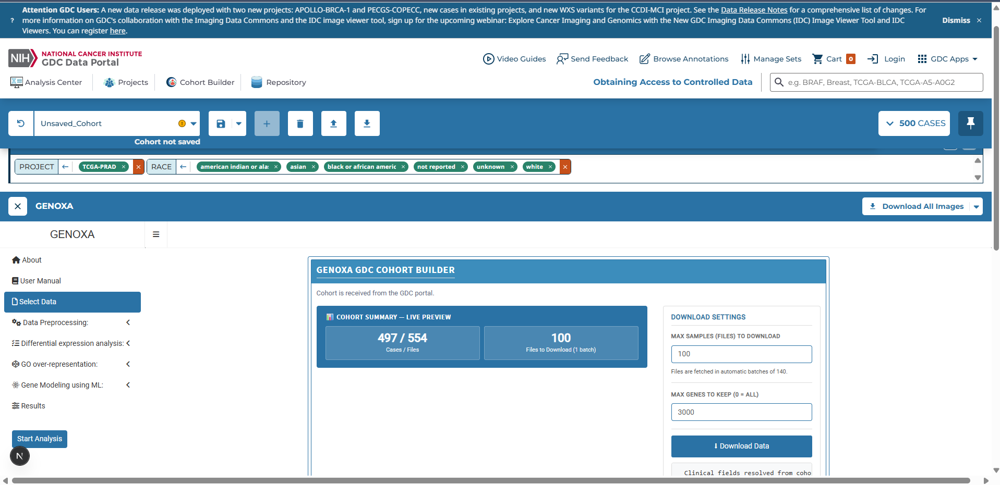
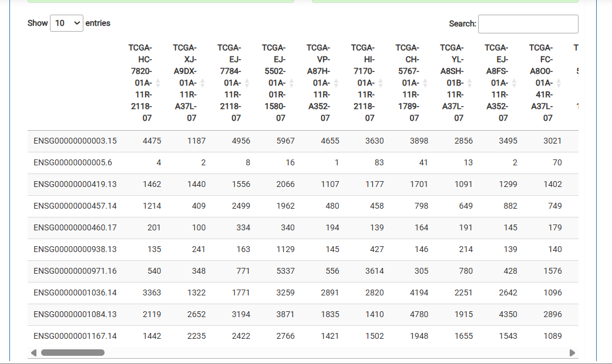
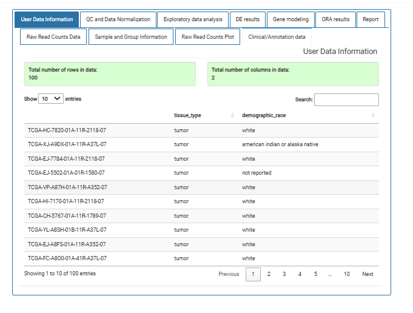
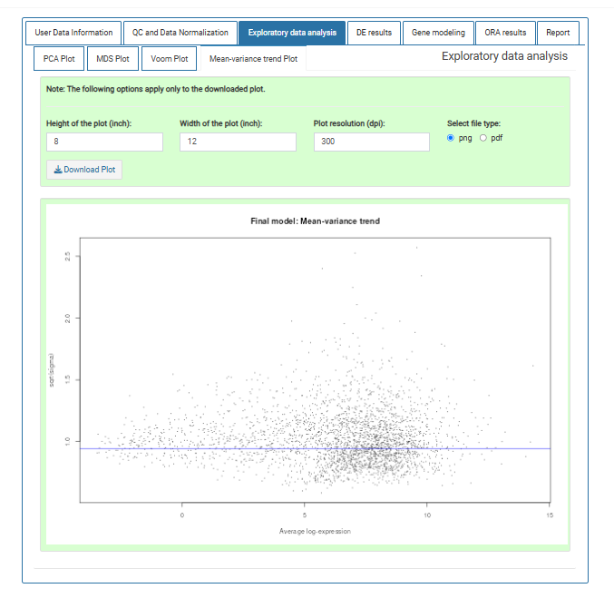
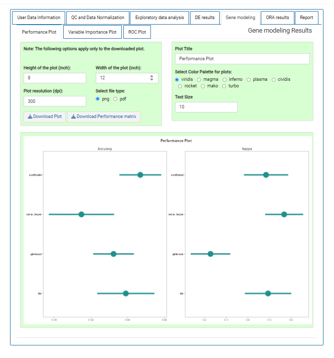
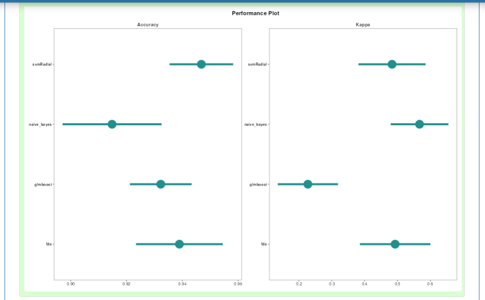
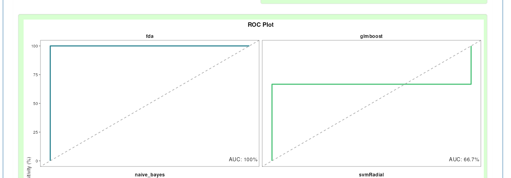
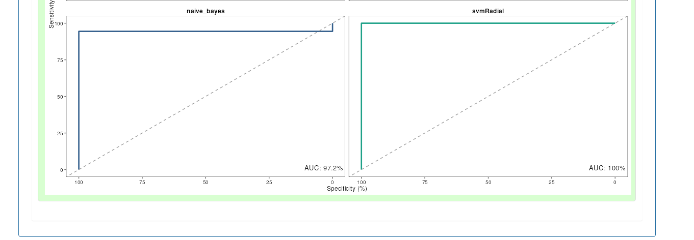

# GDC Frontend Framework

## Installation

### Prerequisites

This is a multi-workspace repo that requires npm v11.11.0. The minimum node version is set to v24.14.0.

Node can be downloaded from the official Node.js site. You may also consider using a [Node version manager](https://docs.npmjs.com/cli/v7/configuring-npm/install#using-a-node-version-manager-to-install-nodejs-and-npm).

Your version of Node may not ship with npm v11.11.0. To install it, run:

```bash
npm install npm@11.11.0
```

If you are using a Node version manager, you can run the following to install the correct version of Node:

```bash
nvm install 24.14.0
```

to use the correct version of Node:

```bash
nvm use 24.14.0
```

### Install Dependencies

From the root of the project, install dependencies by running:

```bash
npm install
```

Installing from the root of the repository is required to avoid
multiple installations of React in the workspaces. When this happens,
React will fail to render.

### Adding Dependencies

Dependencies can also be installed from the root of the repository.
To install a dependency for a specific workspace, you can run:

```bash
npm install --save my-package --workspace=packages/core
```

Since this is a TypeScript project, installing the community type definitions may also be required:

```bash
npm install --save-dev @types/my-package --workspace=packages/core
```

## Development

Run the prototype in dev mode with auto-rebuilding:

```bash
npm run dev
```

Build docker image
```bash
cd gdc-frontend-framework\gdc-docker-backend\GENOXA_V2_FINAL
docker build -t genoxa .
```

Run Backend server
```bash
cd gdc-docker-backend\
node server.js
```

### Steps to Replicate in Original Repo
1. Replace the registeredApps.tsx file which is in this location:- ```gdc-frontend-framework\packages\portal-proto\src\features\user-flow\workflow\registeredApps.tsx```
2. Create a file name SagarPatel_GENOXA.tsx in this location ```gdc-frontend-framework\packages\portal-proto\src\features\apps\{file_name}```
3. Create a folder name genoxa and inside that create a file name GenoxaCaseCount.ts -- location ```gdc-frontend-framework\packages\portal-proto\src\features\{folder_name}\{file_name}```
4. In packages/next.config.js we have added few urls for running docker images and localhost, for production level please comment out those urls and CORSS policy

## GENOXA tutorial
[Watch the GENOXA tutorial on YouTube](https://youtu.be/_6toVe_wJfo)

## Screenshots














## Project Structure

This project is a monorepo managed by [lerna](https://lerna.js.org). It is composed of the following packages:

- `packages/core`: Contains the state management and function for accessing the APIs of the GDC.
- `packages/portal-proto`: The GDC Frontend Framework prototype. This is the main package for the project. It uses NextJS
  as the application framework and React as the UI framework. For basic components we use [Mantine.dev](https://v6.mantine.dev/) (version 6), as the UI library as it compatiable
  with our design system and use of [Tailwind CSS](https://tailwindcss.com). Please note that before the final release
  the package will be renamed to `packages/portal`.
- `packages/sapien`: is the package that contains the Bodyplot UI used on the GDC Portal V2 home page.
- `packages/lighthouse`: is the package that contains the Lighthouse UI used on the GDC Portal V2 home page for testing performance.
- `packages/survivalplot`: is the package that contains the survival plot UI used on the GDC Portal V2 apps.
